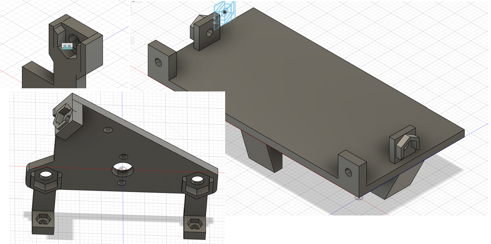

# Nuts and Screws

- Notes regarding nuts and screws

## Index

- [Sockets for Nuts](#sockets-for-nuts)

## Sockets for Nuts

- Sockets for 3D printed parts
  - 
  - It's a major pain when there are nuts and screws that move around in the bot both when assembling and disassembling
  - Add sockets for nuts and superglue them into 3D mounts