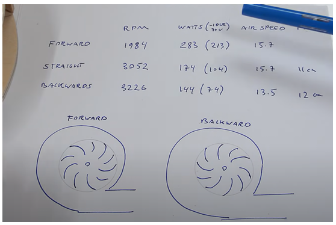
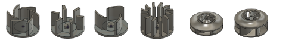

# Vacuum Design Explanation

- Notes regarding mechanical vacuum design choices

## Index

- [Impeller Fan Design](#impeller-fan-design)

## Impeller Fan Design

- Lack of documentation
  - Very involved- wish we had a mechanical engineer on the team
  - For whatever reason, there's no documentation regarding micromouse vacuum fan designs
  - ...Except for this: https://rt-net.jp/mobility/archives/20915
    - ^implements a turbo impeller fan <3
- Different impeller fan types compared
  - Video here: https://www.youtube.com/watch?v=mafjVYfFgg4
  - Turbo fan provides the most suction
- Impeller fans
  - there is documentation on impeller fans in general
    - impeller blower configuration video: https://youtu.be/YuEaP9kyiFc?si=spyc_kHSI9guTJmH
    - impeller fan crafted by hand video: https://youtu.be/Hyz1TMbNVSo?si=MinbotT-jVyszSr6
  - puller configuration
    - 
      - when a fan's wings scoop the air, it's pusher configuration
      - when a fan's wings swing air out, it's puller configuration
      - in the above image, when the fan moves counter-clockwise it's the most efficient design in terms of power consumption and RPM
- Failed designs
  - 
  - Reasons for failure include lack of suction, lack of durability (fan parts break apart), and noise
    - Second to last failing design is intolerably loud
    - Last design is essentially the working design, but a bit too tall and wide
- Green Ye
  - http://greenye.net/Pages/Micromouse/Micromouse2016-2017.htm
  - Allocates 3cm to vacuum on PCB, and 1.5cm for the hole for suction
  - Mouse Unit 07 arbitrarily does the same
- Excel-9a
  - Video: https://www.youtube.com/watch?v=1_KpQ1bw5I8
  - Documentation: https://sites.google.com/site/myprojectq/robotic/classic-micromouse/excel-9a?pli=1
  - The mouse that defies gravity
- Micromouse online
  - https://micromouseonline.com/2018/02/18/more-suck-less-slip/
  - Yes, vacuum means less slip indeed
