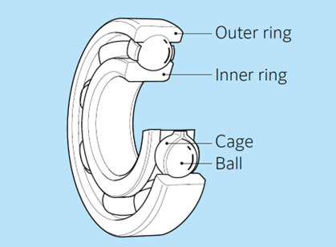

# Wheels and Motor Design Explanation

- Notes regarding wheels and related design choices

## Index

- [4 Wheel Drive](#4-wheel-drive)
- [Gears](#gears)
- [Wheel Bearing Spacers](#wheel-bearing-spacers)- [Mechanical Micromouse Specs](#mechanical-micromouse-specs)

## 4 Wheel Drive

- Decimus 4
  - https://micromouseonline.com/2012/05/16/shapeways-motor-mounts-arrive/
  - https://micromouseonline.com/2012/05/24/printed-wheels-complete-decimus-mechanicals/
  - The key is to use ball bearings, spacers, and a screw for a shaft for the wheels to rotate
  - M3 screws and 3mm diameter ball bearings are used for Mouse Unit 07
- Designing gears
  - The key is to design wheels w/ gears on them
  - More details in mechanical design guide

## Gears

- Fusion 360 guide to making gears: https://www.youtube.com/watch?v=B8A_11o7QZ0

## Wheel Bearing Spacers

- 
- Needed to prevent outer ring of ball-bearings from touching 3D printed mounts and screw heads
- Crucial that they're made of metal- tried to 3D print spacers, but they eventually mold into the shapes of the parts they're spaced between
