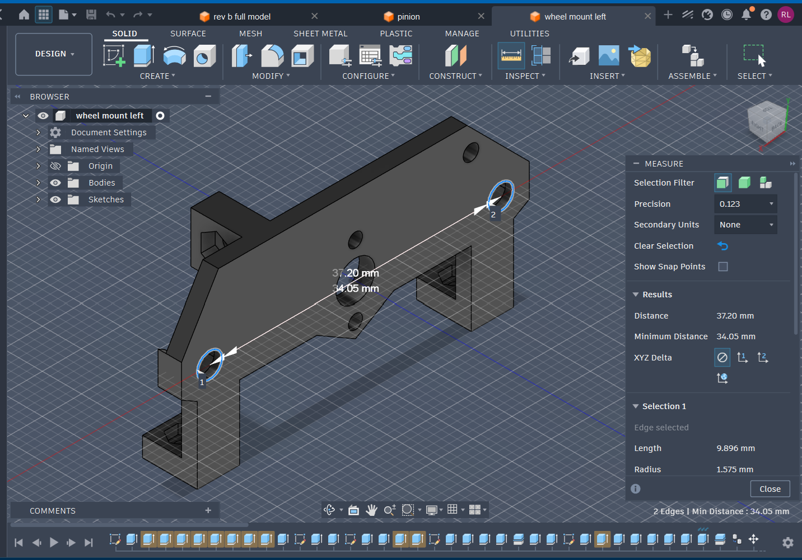

# Wheels and Motor Design Explanation

- Notes regarding wheels and related design choices

## Index

- [4 Wheel Drive](#4-wheel-drive)
- [Gears](#gears)
- [Wheel Bearing Spacers](#wheel-bearing-spacers)- [Mechanical Micromouse Specs](#mechanical-micromouse-specs)

## 4 Wheel Drive

- Decimus 4
  - https://micromouseonline.com/2012/05/16/shapeways-motor-mounts-arrive/
  - https://micromouseonline.com/2012/05/24/printed-wheels-complete-decimus-mechanicals/
  - The key is to use ball bearings, spacers, and a screw for a shaft for the wheels to rotate
  - M3 screws and 3mm diameter ball bearings are used for Mouse Unit 07
- Designing gears
  - The key is to design wheels w/ gears on them
  - More details in mechanical design guide

## Gears

- Fusion 360 guide to making gears: https://www.youtube.com/watch?v=B8A_11o7QZ0
- To minimize friction, below settings were used w/ the spur gear generation tool:

```
given 32mm wheels, and target gear ratio of 13:44 pinion to wheel gear:

wheel gear:
- teeth: 44
- module: 0.65
- pressure angle: 20 degrees
- backlash: 0.15
- root fillet radius: 0.38mm
- gear thickness: 3mm
- calculated pitch diameter of 28.6mm (0.65 * 44 = 28.6mm)
- calculated outer diameter of 0.65(44 + 2) = 29.9mm

pinion:
- teeth: 13
- module: 0.65
- pressure angle: 20 degrees
- backlash: 0.15
- root fillet radius: 0.38mm
- gear thickness: 3mm
- calculated pitch diameter of 28.6mm (0.65 * 13 = 8.5mm)
- calculated outer diameter of 0.65(13 + 2) = 9.75mm

```

- Gear train orientation
  - 
  - The pinion gear was originally raised above the wheel gears to reduce wheel to wheel distance, but keeping the pinion at the same height as the wheel gears helps reduce friction
  - Given module of 0.65, 44 teeth on the wheel gear, and 13 teeth on the pinion, the distance from pinion to wheel gear is at minimum:
    - 0.65(13 + 44) / 2 = 18.525
  - To reduce friction, a distance of 18.6mm is used

## Wheel Bearing Spacers

- 
- Needed to prevent outer ring of ball-bearings from touching 3D printed mounts and screw heads
- Crucial that they're made of metal- tried to 3D print spacers, but they eventually mold into the shapes of the parts they're spaced between
